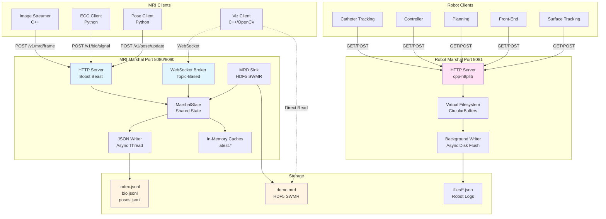
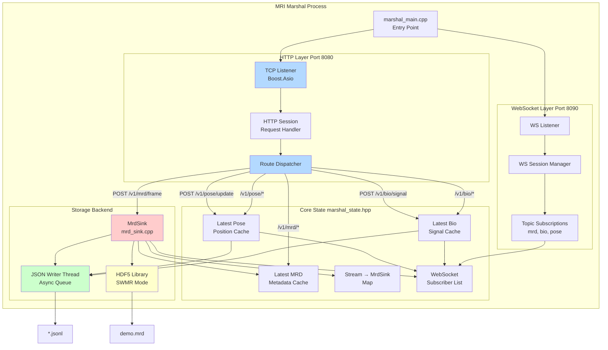
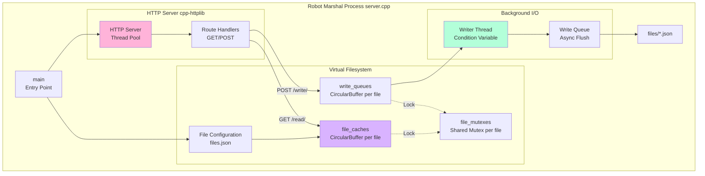
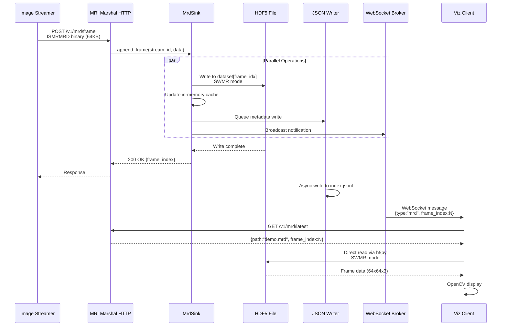
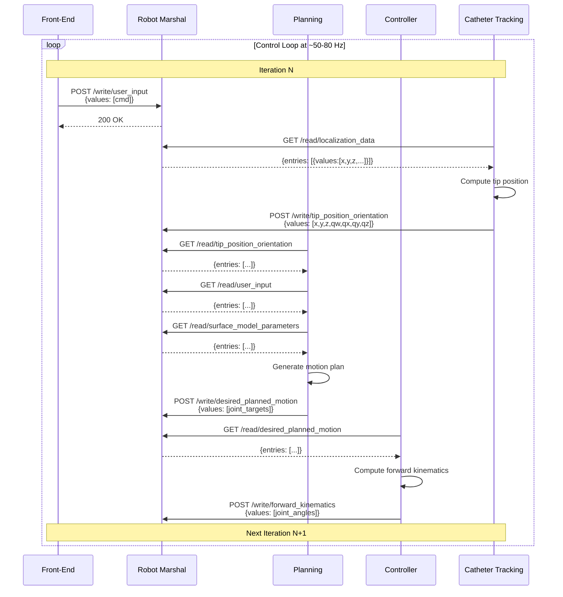
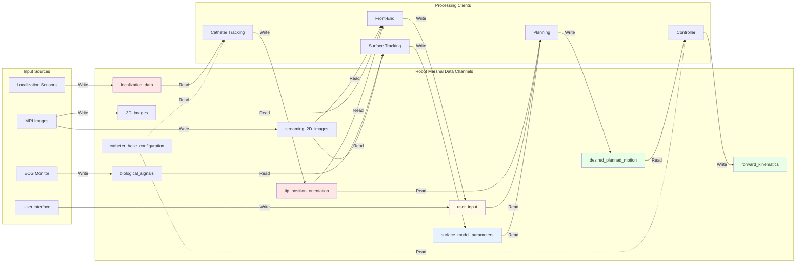

# CWRU Data Marshal - Detailed Architecture Documentation

**Generated:** 2026-01-27
**System:** Dual-Marshal Architecture for MRI-Guided Robotic Surgery

---

## Table of Contents

1. [System Overview](#system-overview)
2. [Architecture Diagrams](#architecture-diagrams)
3. [Marshal Specifications](#marshal-specifications)
4. [API Reference](#api-reference)
5. [Client Implementations](#client-implementations)
6. [Data Flows and Use Cases](#data-flows-and-use-cases)
7. [Configuration](#configuration)

---

## 1. System Overview

The CWRU Data Marshal system consists of two independent marshals working in parallel:

- **MRI Marshal**: Handles medical imaging data (ISMRMRD), biological signals (ECG), and pose/tracking data
- **Robot Marshal**: Manages robot control state exchange and catheter system coordination

### Key Design Principles

- **Metadata-Only HTTP API**: Lightweight endpoints return file paths and indices, not large binary data
- **Direct File Access**: Clients read binary data directly from HDF5 files using SWMR (Single Writer Multiple Readers)
- **Asynchronous I/O**: Background threads handle disk writes to prevent blocking hot paths
- **Pub/Sub Notifications**: WebSocket broadcasts notify clients of data availability
- **Blackboard Pattern**: Robot clients coordinate through shared state (no direct communication)

---

## 2. Architecture Diagrams

### 2.1 High-Level System Architecture



### 2.2 MRI Marshal Component Architecture



### 2.3 Robot Marshal Component Architecture



### 2.4 MRI Data Flow Sequence



### 2.5 Robot Control Loop Sequence



### 2.6 Data Channel Topology (Robot Marshal)



---

## 3. Marshal Specifications

### 3.1 MRI Marshal

**Location:** `.worktrees/mri_data_marshal/`
**Language:** C++17
**Build System:** CMake
**Dependencies:** Boost.Beast, Boost.Asio, HDF5, ISMRMRD

#### Ports
- **8080**: HTTP REST API
- **8090**: WebSocket pub/sub

#### Key Files
| File | Purpose | Lines |
|------|---------|-------|
| `src/marshal_main.cpp` | Entry point, server initialization | ~200 |
| `src/marshal_http.hpp` | HTTP request handlers | ~400 |
| `src/marshal_ws.hpp` | WebSocket session management | ~300 |
| `src/marshal_state.hpp` | Shared state (caches, sinks, subscribers) | ~250 |
| `src/mrd_sink.cpp` | HDF5 SWMR writer implementation | ~500 |
| `include/mrd_sink.hpp` | MRD sink interface | ~100 |

#### Threading Model
- **Main thread**: HTTP listener (Boost.Asio event loop)
- **WS thread**: WebSocket listener (separate io_context)
- **JSON writer thread**: Async JSONL disk I/O
- **Per-client threads**: Each HTTP/WS session runs on thread pool

#### Memory Management
- In-memory caches: ~1 KB per latest frame/signal/pose
- HDF5 chunk cache: Configurable (default 1 MB)
- WebSocket queue: Max 1000 messages per client

### 3.2 Robot Marshal

**Location:** `.worktrees/robot_data_marshal/`
**Language:** C++17
**Build System:** CMake
**Dependencies:** cpp-httplib (single-header), nlohmann/json

#### Ports
- **8081**: HTTP REST API

#### Key Files
| File | Purpose | Lines |
|------|---------|-------|
| `server.cpp` | Main server implementation | ~408 |
| `circularBuffer.hpp` | Lock-free circular buffer | ~150 |
| `files.json` | Data channel configuration | JSON config |
| `file_routes.json` | Client routing table | JSON config |

#### Threading Model
- **Main thread**: HTTP server (cpp-httplib thread pool)
- **Writer thread**: Background disk flush
- **Request threads**: Per-request from thread pool (default: 8)

#### Memory Management
- Circular buffers: 1000 entries per channel × 13 channels
- Each entry: ~1-10 KB (depends on data type)
- Total in-memory: ~10-100 MB

---

## 4. API Reference

### 4.1 MRI Marshal REST API

#### Health & Configuration

**GET /health**
- Description: Health check endpoint
- Response: `200 OK` `{"status": "ok"}`

**GET /v1/config**
- Description: Get marshal configuration
- Response: `{"data_dir": "/path", "default_stream": "demo", ...}`

#### MRI Frame Endpoints

**POST /v1/mrd/frame**
- Description: Append ISMRMRD frame to dataset
- Headers: `X-MRD-Stream: <stream_id>` (optional, default: "demo")
- Body: Binary ISMRMRD acquisition data
- Response: `{"frame_index": 42, "timestamp": "2026-01-27T..."}`
- Performance: ~1ms for 64KB frame

**GET /v1/mrd/latest**
- Description: Get latest frame metadata
- Query: `?stream=<stream_id>` (optional)
- Response: `{"data": {"path": "/session-data/mrd/demo.mrd", "frame_index": 42}}`

**GET /v1/mrd/frame?path=...&index=...**
- Description: Get specific frame metadata
- Query Parameters:
  - `path`: HDF5 file path
  - `index`: Frame index
- Response: `{"data": {"frame_index": 42, "timestamp": "..."}}`

**GET /v1/mrd/since?ts=...&limit=...**
- Description: Query frames by timestamp
- Query Parameters:
  - `ts`: ISO8601 timestamp
  - `limit`: Max results (default: 100)
- Response: `{"data": [{"frame_index": 40, ...}, ...]}`

**GET /v1/mrd/since?last=N**
- Description: Get last N frames
- Query: `last`: Number of recent frames
- Response: `{"data": [...]}`

**GET /v1/mrd/ingest?path=...**
- Description: Get file metadata for HDF5 access
- Query: `path`: HDF5 file path
- Response: `{"dataset": "/images/data", "shape": [1000, 1, 3, 64, 64]}`

#### Biological Signal Endpoints

**POST /v1/bio/signal**
- Description: Submit biological signal (ECG, etc.)
- Body:
  ```json
  {
    "source": "ecg_monitor_1",
    "data": [1.2, 1.3, 1.1, ...],
    "rate_hz": 250.0
  }
  ```
- Response: `200 OK`

**GET /v1/bio/latest**
- Description: Get latest biological signal
- Response:
  ```json
  {
    "data": {
      "source": "ecg_monitor_1",
      "data": [1.2, 1.3, ...],
      "rate_hz": 250.0,
      "timestamp": "2026-01-27T..."
    }
  }
  ```

#### Pose Endpoints

**POST /v1/pose/update**
- Description: Submit pose/tracking update
- Body:
  ```json
  {
    "p": [1.0, 2.0, 3.0],
    "R": [1, 0, 0, 0, 1, 0, 0, 0, 1]
  }
  ```
- Response: `200 OK`

**GET /v1/pose/current**
- Description: Get current pose
- Response:
  ```json
  {
    "data": {
      "p": [1.0, 2.0, 3.0],
      "R": [1, 0, 0, 0, 1, 0, 0, 0, 1],
      "timestamp": "2026-01-27T..."
    }
  }
  ```

### 4.2 MRI Marshal WebSocket API

**Connection:** `ws://localhost:8090/ws`

**Subscribe to Topic:**
```json
{"subscribe": "mrd"}
```
```json
{"subscribe": "bio"}
```
```json
{"subscribe": "pose"}
```

**Notification Format:**
```json
{
  "type": "mrd",
  "frame_index": 42,
  "timestamp": "2026-01-27T12:34:56.789Z"
}
```

**Rate Limiting:** Max 1000 queued messages per client. Exceeding this closes the connection.

### 4.3 Robot Marshal REST API

**GET /**
- Description: List all available data channels
- Response: HTML page with links to all files

**GET /read/\<filename\>**
- Description: Read from data channel
- Response:
  ```json
  {
    "entries": [
      {
        "sent_at": 1706356496123456789,
        "values": [1.0, 2.0, 3.0]
      },
      ...
    ]
  }
  ```
- Notes: Returns up to 1000 most recent entries (circular buffer)

**POST /write/\<filename\>**
- Description: Write to data channel
- Body:
  ```json
  {
    "sent_at": 1706356496123456789,
    "values": [1.0, 2.0, 3.0]
  }
  ```
- Response: `200 OK`

#### Available Data Channels

| Channel | Purpose | Typical Size |
|---------|---------|--------------|
| `localization_data` | Sensor positions (x, y, z) × N sensors | ~100 floats |
| `catheter_base_configuration` | System configuration | ~50 floats |
| `forward_kinematics` | Joint angles | ~10 floats |
| `tip_position_orientation` | Catheter tip pose (x,y,z,qw,qx,qy,qz) | 7 floats |
| `desired_planned_motion` | Motion plan targets | ~20 floats |
| `biological_signals` | ECG/vitals | ~1000 samples |
| `surface_model_parameters` | Heart surface model | ~500 floats |
| `user_input` | Doctor commands | ~10 values |
| `streaming_2D_images` | Live 2D imaging | Variable |
| `3D_images` | 3D volumes | Variable |

---

## 5. Client Implementations

### 5.1 MRI Marshal Clients

#### Image Streamer (C++)

**Location:** `.worktrees/mri_data_marshal/clients/image_streamer/`

**Purpose:** Generates synthetic ISMRMRD frames for testing

**Key Features:**
- Configurable frame rate (default: 20 FPS)
- Generates 64×64×3 complex float arrays
- Posts binary ISMRMRD data to `/v1/mrd/frame`
- Simulates realistic MRI acquisition timing

**Usage:**
```bash
./image_streamer --fps 20 --url http://localhost:8080
```

#### ECG Client (Python)

**Location:** `.worktrees/mri_data_marshal/clients/mocks/ecg_client.py`

**Purpose:** Generates synthetic ECG waveforms

**Key Features:**
- Simulates realistic ECG (P-QRS-T complexes)
- Configurable heart rate (default: 72 BPM)
- Sampling rate: 250 Hz
- Posts to `/v1/bio/signal`

**Usage:**
```bash
python ecg_client.py --bpm 72
```

#### Pose Client (Python)

**Location:** `.worktrees/mri_data_marshal/clients/mocks/pose_client.py`

**Purpose:** Generates tracking trajectories

**Key Features:**
- Circular or linear motion patterns
- Configurable radius and speed
- Posts to `/v1/pose/update`

**Usage:**
```bash
python pose_client.py --pattern circular --radius 10
```

#### Visualization Client (C++/OpenCV)

**Location:** `.worktrees/mri_data_marshal/clients/viz_client/`

**Purpose:** Real-time 3D MRI visualization

**Key Features:**
- WebSocket subscription for frame notifications
- Direct HDF5 SWMR reads (no HTTP bottleneck)
- OpenCV multi-slice display
- Sub-100ms latency

**Code Pattern:**
```cpp
// 1. Subscribe to WebSocket
ws_client.on_message([&](json msg) {
    if (msg["type"] == "mrd") {
        int idx = msg["frame_index"];
        display_frame(idx);
    }
});

// 2. Read HDF5 directly
void display_frame(int idx) {
    h5::File file("demo.mrd", h5::File::ReadOnly | h5::File::SWMR);
    auto dset = file.openDataSet("/images/data");
    dset.refresh();  // See latest frames

    // Read frame [channels=1, z=3, y=64, x=64]
    dset.read(buffer, idx);

    cv::imshow("Slice 1", buffer[0]);
    cv::imshow("Slice 2", buffer[1]);
    cv::imshow("Slice 3", buffer[2]);
}
```

### 5.2 Robot Marshal Clients

#### Catheter Tracking Client

**Purpose:** Computes catheter tip position from sensor data

**Data Flow:**
- Reads: `localization_data`, `catheter_base_configuration`
- Writes: `tip_position_orientation`

**Algorithm:**
```
localization_data (sensor positions)
  → Forward kinematics calculation
  → tip_position_orientation (x, y, z, quaternion)
```

#### Controller Client

**Purpose:** Translates motion plans to joint commands

**Data Flow:**
- Reads: `desired_planned_motion`
- Writes: `forward_kinematics`

#### Planning Client

**Purpose:** Generates motion plans to target positions

**Data Flow:**
- Reads: `tip_position_orientation`, `surface_model_parameters`, `user_input`
- Writes: `desired_planned_motion`

**Algorithm:**
```
Current tip pose + Target from user + Surface constraints
  → Path planning (collision-free)
  → Motion plan (joint space trajectory)
```

#### Front-End Client

**Purpose:** User interface and visualization

**Data Flow:**
- Reads: `streaming_2D_images`, `3D_images`, `tip_position_orientation`
- Writes: `user_input`

#### Surface Tracking Client

**Purpose:** Tracks heart surface motion from imaging

**Data Flow:**
- Reads: `biological_signals`, `streaming_2D_images`
- Writes: `surface_model_parameters`

**Algorithm:**
```
ECG gating + 2D images
  → 3D surface reconstruction
  → Motion model parameters
```

---

## 6. Data Flows and Use Cases

### 6.1 Use Case: Real-Time MRI Monitoring

**Actors:** Image Streamer, MRI Marshal, Visualization Client

**Flow:**
1. Image Streamer acquires frame from MRI scanner
2. POST binary ISMRMRD data (64 KB) to `/v1/mrd/frame`
3. Marshal writes to HDF5 SWMR (`demo.mrd`)
4. Marshal updates in-memory cache
5. Marshal broadcasts WebSocket notification
6. Viz Client receives notification
7. Viz Client reads frame directly from HDF5
8. Viz Client displays on screen

**Performance:**
- Latency: ~50-100ms end-to-end
- Throughput: 20-50 FPS
- Bandwidth: HTTP ~1 MB/s, HDF5 ~5 MB/s

### 6.2 Use Case: ECG-Gated Imaging

**Actors:** ECG Client, MRI Marshal, Image Streamer

**Flow:**
1. ECG Client posts bio signal at 250 Hz
2. Marshal caches latest ECG data
3. Marshal broadcasts on `bio` topic
4. Image Streamer subscribes to `bio` WebSocket
5. Image Streamer triggers acquisition at R-peak
6. Synchronized imaging with cardiac cycle

### 6.3 Use Case: Catheter Control Loop

**Actors:** 5 Robot Clients, Robot Marshal

**Flow (per 20ms cycle):**
1. **Tracking**: Read sensors → Compute tip pose → Write tip
2. **Planning**: Read tip + surface + user → Generate plan → Write motion
3. **Controller**: Read motion → Compute joints → Write FK
4. **Front-End**: Read images + tip → Display → Write user commands
5. **Surface**: Read ECG + images → Update model → Write surface

**Coordination:**
- All communication via Robot Marshal (blackboard)
- No direct client-to-client messaging
- Circular buffers ensure lock-free reads
- ~50-80 Hz control rate

### 6.4 Use Case: Offline Analysis

**Actors:** Researcher, MRI Marshal, HDF5 File

**Flow:**
1. GET `/v1/mrd/ingest?path=demo.mrd` to get file info
2. Open `demo.mrd` in SWMR read mode
3. Read entire `/images/data` dataset
4. Process frames (reconstruction, segmentation, etc.)
5. Export results (DICOM, NIfTI, etc.)

**Advantages:**
- No marshal involvement during processing
- Full read speed of HDF5 (~GB/s)
- Multiple simultaneous readers (SWMR)

### 6.5 Use Case: Multi-Client Streaming

**Actors:** Image Streamer, 3× Viz Clients, MRI Marshal

**Flow:**
1. Image Streamer posts frame
2. Marshal writes to HDF5 once
3. Marshal broadcasts WebSocket notification once
4. All 3 viz clients receive notification
5. Each client reads HDF5 independently (SWMR)

**Scalability:**
- HTTP overhead: 1× (single POST)
- HDF5 overhead: 1× (single write)
- Read scalability: Linear with SWMR (3× reads)

---

## 7. Configuration

### 7.1 Environment Variables

**MRI Marshal** (`.env.demo`):
```bash
MRD_DATA_DIR=/session-data/mrd
MRD_HTTP_PORT=8080
MRD_WS_PORT=8090
MRD_DEFAULT_STREAM=demo
MRD_BODY_LIMIT=134217728  # 128 MiB
```

**Robot Marshal**:
```bash
ROBOT_MARSHAL_PORT=8081
ROBOT_DATA_DIR=/session-data/robot
```

### 7.2 Docker Compose

**File:** `docker-compose.demo.yml`

**Services:**
- `mri-marshal`: MRI data marshal (ports 8080, 8090)
- `robot-marshal`: Robot control marshal (port 8081)
- `image-streamer`: Synthetic frame generator
- `ecg-client`: ECG simulator
- `pose-client`: Pose trajectory generator
- `viz-client`: Visualization (optional, requires X11)

**Volumes:**
- `session-data`: Shared persistent storage
- Host bind mounts for development

### 7.3 Build Configuration

**MRI Marshal CMake**:
```cmake
find_package(Boost REQUIRED COMPONENTS system)
find_package(HDF5 REQUIRED COMPONENTS CXX)
find_package(ISMRMRD REQUIRED)

add_executable(mri_marshal
    src/marshal_main.cpp
    src/mrd_sink.cpp
)
target_link_libraries(mri_marshal
    Boost::system
    HDF5::HDF5
    ISMRMRD::ISMRMRD
)
```

**Robot Marshal CMake**:
```cmake
# Header-only dependencies
include_directories(vendor/cpp-httplib)
include_directories(vendor/json)

add_executable(robot_marshal server.cpp)
```

### 7.4 Robot Marshal Data Channel Config

**File:** `files.json`

```json
{
  "localization_data": {"capacity": 1000},
  "catheter_base_configuration": {"capacity": 100},
  "forward_kinematics": {"capacity": 1000},
  "tip_position_orientation": {"capacity": 1000},
  "desired_planned_motion": {"capacity": 1000},
  "biological_signals": {"capacity": 5000},
  "surface_model_parameters": {"capacity": 1000},
  "user_input": {"capacity": 1000},
  "streaming_2D_images": {"capacity": 100},
  "3D_images": {"capacity": 10}
}
```

**File:** `file_routes.json`

```json
{
  "catheter-tracking": {
    "read_from": "localization_data",
    "write_to": "tip_position_orientation"
  },
  "controller": {
    "read_from": "desired_planned_motion",
    "write_to": "forward_kinematics"
  },
  "planning": {
    "read_from": ["tip_position_orientation", "surface_model_parameters", "user_input"],
    "write_to": "desired_planned_motion"
  }
}
```

---

## 8. Performance Characteristics

### 8.1 MRI Marshal Benchmarks

| Operation | Latency | Throughput |
|-----------|---------|------------|
| POST /v1/mrd/frame (64 KB) | ~1ms | 20-50 FPS |
| GET /v1/mrd/latest | ~100μs | 10,000 req/s |
| WebSocket broadcast | ~500μs | 2,000 msg/s |
| HDF5 SWMR write | ~2ms | 500 frames/s |
| HDF5 SWMR read | ~500μs | 2,000 frames/s |

### 8.2 Robot Marshal Benchmarks

| Operation | Latency | Throughput |
|-----------|---------|------------|
| GET /read/\<file\> | ~200μs | 5,000 req/s |
| POST /write/\<file\> | ~300μs | 3,000 req/s |
| In-memory cache hit | ~50μs | 20,000 ops/s |
| Background disk write | ~5ms | Async, non-blocking |

### 8.3 System-Level Metrics

- **End-to-end latency** (Image → Display): 50-100ms
- **Control loop rate**: 50-80 Hz
- **Concurrent clients**: 10+ (tested)
- **Data retention**: Unlimited (disk-bound)
- **Memory footprint**: ~100 MB per marshal

---

## 9. Technology Stack

### Core Technologies

| Component | Technology | Version |
|-----------|------------|---------|
| MRI Marshal | C++17 | GCC 11+ |
| Robot Marshal | C++17 | GCC 11+ |
| HTTP (MRI) | Boost.Beast | 1.75+ |
| HTTP (Robot) | cpp-httplib | 0.11+ |
| WebSocket | Boost.Beast | 1.75+ |
| Data Storage | HDF5 SWMR | 1.12+ |
| MRI Format | ISMRMRD | 1.8+ |
| JSON | nlohmann/json | 3.10+ |
| Build System | CMake | 3.20+ |
| Container | Docker | 20.10+ |

### Client Technologies

| Client | Language | Libraries |
|--------|----------|-----------|
| Image Streamer | C++17 | ISMRMRD, libcurl |
| ECG Client | Python 3.9+ | requests, numpy |
| Pose Client | Python 3.9+ | requests, numpy |
| Viz Client | C++17 | OpenCV, HDF5, WebSocket++ |
| Robot Clients | C++17 | cpp-httplib, Eigen |

---

## 10. File Structure

```
cwru_data_marshal/
├── .worktrees/
│   ├── mri_data_marshal/          # MRI Marshal (main worktree)
│   │   ├── src/
│   │   │   ├── marshal_main.cpp   # Entry point
│   │   │   ├── marshal_http.hpp   # HTTP handlers
│   │   │   ├── marshal_ws.hpp     # WebSocket server
│   │   │   ├── marshal_state.hpp  # Shared state
│   │   │   └── mrd_sink.cpp       # HDF5 writer
│   │   ├── include/
│   │   │   └── mrd_sink.hpp       # Sink interface
│   │   ├── clients/
│   │   │   ├── image_streamer/    # Frame generator
│   │   │   ├── viz_client/        # Visualization
│   │   │   └── mocks/             # ECG, pose clients
│   │   ├── CMakeLists.txt
│   │   └── README.md
│   │
│   └── robot_data_marshal/        # Robot Marshal (worktree branch)
│       ├── server.cpp             # Main server
│       ├── circularBuffer.hpp     # Lock-free buffer
│       ├── files.json             # Channel config
│       ├── file_routes.json       # Client routing
│       ├── client-*.cpp           # 5 catheter clients
│       └── CMakeLists.txt
│
├── docker/
│   ├── mri-marshal.Dockerfile
│   ├── robot-marshal.Dockerfile
│   └── clients.Dockerfile
│
├── docs/
│   ├── API_REFERENCE.md           # Full API docs
│   └── EXTERNAL_CLIENT_GUIDE.md   # Integration guide
│
├── docker-compose.demo.yml
├── .env.demo
└── README.md
```

---

## 11. Deployment

### Development Mode

```bash
# Start all services
docker-compose -f docker-compose.demo.yml up

# Verify marshals
curl http://localhost:8080/health  # MRI Marshal
curl http://localhost:8081/        # Robot Marshal
```

### Production Considerations

1. **Security**: Add authentication (JWT, mTLS)
2. **Monitoring**: Prometheus metrics, health checks
3. **Backup**: Periodic HDF5 snapshot to S3/NFS
4. **Scaling**: Deploy marshals on separate nodes
5. **Network**: Low-latency network (10 GbE+)
6. **Storage**: NVMe SSD for HDF5 (>1 GB/s)

---

## Appendix A: Glossary

- **ISMRMRD**: Imaging Sequence Model for Raw Data (MRI standard)
- **HDF5**: Hierarchical Data Format (binary storage)
- **SWMR**: Single Writer Multiple Readers (HDF5 mode)
- **Blackboard Pattern**: Shared state coordination (AI architecture)
- **Boost.Beast**: C++ HTTP/WebSocket library
- **Boost.Asio**: Async I/O library
- **cpp-httplib**: Single-header C++ HTTP library

---

## Appendix B: References

- [MRI Marshal Source](.worktrees/mri_data_marshal/)
- [Robot Marshal Source](.worktrees/robot_data_marshal/)
- [API Reference](docs/API_REFERENCE.md)
- [Client Guide](docs/EXTERNAL_CLIENT_GUIDE.md)
- [HDF5 SWMR Docs](https://docs.hdfgroup.org/hdf5/latest/group___s_w_m_r.html)
- [ISMRMRD Spec](https://ismrmrd.readthedocs.io/)
- [Boost.Beast Docs](https://www.boost.org/doc/libs/release/libs/beast/)

---

**Document Version:** 1.0
**Last Updated:** 2026-01-27
**Generated by:** Claude Code Architecture Analysis
