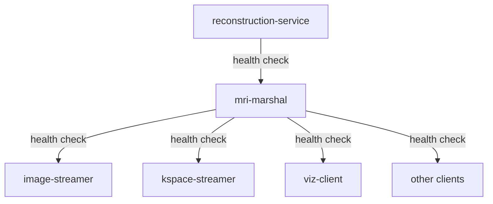

# Docker Compose Setup with Reconstruction Service

## Overview

This guide shows how to run the MRI Marshal with reconstruction service support using Docker Compose.

## Architecture in Docker

```
┌─────────────────────────────────────────────────────────────┐
│                    Docker Network: cwru-net                 │
├─────────────────────────────────────────────────────────────┤
│                                                             │
│  ┌─────────────────┐                                        │
│  │ kspace-streamer │ (sends raw k-space)                   │
│  │ :none           │                                        │
│  └────────┬────────┘                                        │
│           │                                                 │
│           │ POST /v1/mrd/ingest                            │
│           │ Raw k-space data                               │
│           ▼                                                 │
│  ┌──────────────────────────────────┐                      │
│  │ mri-marshal                      │                      │
│  │ :8080 (HTTP)                     │                      │
│  │ :8090 (WebSocket)                │                      │
│  │                                  │                      │
│  │ --recon-endpoint                 │                      │
│  │   reconstruction-service:9002    │                      │
│  └──────┬───────────────────────┬───┘                      │
│         │                       │                          │
│         │ HTTP POST             │ HTTP 200                 │
│         │ /reconstruct          │ Reconstructed            │
│         ▼                       │ ImageHeader+pixels       │
│  ┌──────────────────────┐       │                          │
│  │ reconstruction-      │       │                          │
│  │ service              │───────┘                          │
│  │ :9002                │                                  │
│  │ (Gadgetron)          │                                  │
│  └──────────────────────┘                                  │
│                                                             │
│         │ (marshal stores reconstructed data)              │
│         ▼                                                   │
│  ┌──────────────────┐                                      │
│  │ /session-data/   │                                      │
│  │ run_*/mrd/*.mrd  │                                      │
│  └────────┬─────────┘                                      │
│           │                                                 │
│           │ SWMR Read                                      │
│           ▼                                                 │
│  ┌──────────────────┐                                      │
│  │ viz-client       │                                      │
│  │ (visualization)  │                                      │
│  └──────────────────┘                                      │
│                                                             │
└─────────────────────────────────────────────────────────────┘
         ▲                                    ▲
         │                                    │
    localhost:8080                       localhost:9002
    (MRI Marshal)                        (Recon Service)
```

## Setup Options

### Option 1: Existing Setup (Reconstructed Images Only)

**Current behavior:** No reconstruction service, only accepts pre-reconstructed images.

```bash
# Start existing demo
docker-compose -f docker-compose.demo.yml up

# Image streamer sends reconstructed images → marshal stores them
```

**Services:**
- `mri-marshal:8080` - Accepts reconstructed images
- `image-streamer` - Sends reconstructed ImageHeader + pixels
- `viz-client` - Displays images

### Option 2: Add Reconstruction Service

**New behavior:** Marshal can accept raw k-space and forward to reconstruction service.

```bash
# Start demo + reconstruction service
docker-compose \
  -f docker-compose.demo.yml \
  -f docker-compose.recon.yml \
  up

# K-space streamer sends raw k-space → marshal → recon → marshal → storage
```

**Additional services:**
- `reconstruction-service:9002` - Gadgetron or custom service
- `mri-marshal` - Enhanced with `--recon-endpoint` flag
- `kspace-streamer` - Sends raw k-space (optional, use --profile kspace)

## Configuration Files

### docker-compose.demo.yml (Existing)

Current production setup:
- MRI Marshal (port 8080, 8090)
- Robot Marshal (port 8081)
- Image Streamer (sends reconstructed images)
- Various clients (ECG, pose, viz, robot clients)

### docker-compose.recon.yml (New)

Extends demo setup with:
- Reconstruction service (port 9002)
- MRI Marshal with `--recon-endpoint` flag
- Optional k-space streamer client

## Usage Examples

### Example 1: Run with Existing Image Streamer (Reconstructed)

```bash
# No changes needed - works as before
docker-compose -f docker-compose.demo.yml up

# Image streamer sends:
# POST /v1/mrd/frame
# Body: [ImageHeader + pixels]
#
# Marshal detects: IMAGE type
# Marshal stores: Directly to SWMR
```

### Example 2: Run with Reconstruction Service

```bash
# Start everything including reconstruction service
docker-compose \
  -f docker-compose.demo.yml \
  -f docker-compose.recon.yml \
  up
```

**What happens:**
1. Reconstruction service starts on port 9002
2. MRI Marshal starts with `--recon-endpoint http://reconstruction-service:9002`
3. Marshal can now accept both:
   - Reconstructed images (stores directly)
   - Raw k-space (forwards to reconstruction service)

### Example 3: Send Raw K-Space Data

```bash
# Start with k-space streamer profile
docker-compose \
  -f docker-compose.demo.yml \
  -f docker-compose.recon.yml \
  --profile kspace \
  up

# K-space streamer sends:
# POST /v1/mrd/ingest
# Body: [Raw AcquisitionHeader + k-space samples]
#
# Marshal detects: ACQUISITION type
# Marshal forwards: HTTP POST to reconstruction-service:9002/reconstruct
# Recon service: Processes and returns ImageHeader + pixels
# Marshal stores: Reconstructed data to /session-data/
```

### Example 4: Manual Testing

```bash
# Terminal 1: Start services
docker-compose -f docker-compose.demo.yml -f docker-compose.recon.yml up

# Terminal 2: Check reconstruction service health
curl http://localhost:9002/health

# Terminal 3: Send raw k-space (will be reconstructed)
curl -X POST http://localhost:8080/v1/mrd/ingest \
  -H "X-MRD-Stream: test_scan" \
  -H "Content-Type: application/octet-stream" \
  --data-binary @raw_kspace.bin

# Response:
# {
#   "status": "reconstructed_and_stored",
#   "path": "/session-data/run_20260129_*/mrd/test_scan.mrd",
#   "frame_index": 0
# }
```

## Environment Variables

### For docker-compose.demo.yml

```bash
# Image streamer settings
export IMAGE_INTERVAL=50        # ms between frames
export IMAGE_WIDTH=64
export IMAGE_HEIGHT=64
export IMAGE_SLICES=3
export IMAGE_LOG_STRIDE=10

# ECG client settings
export ECG_INTERVAL=0.002       # 2ms (500 Hz)
export ECG_HEART_RATE=72

# Pose client settings
export POSE_INTERVAL=0.02       # 20ms (50 Hz)
export POSE_TRAJECTORY=circular
```

### For docker-compose.recon.yml

```bash
# K-space streamer settings
export KSPACE_INTERVAL=100      # ms between acquisitions
export KSPACE_SAMPLES=256       # samples per readout
export KSPACE_CHANNELS=32       # coil channels
```

## Reconstruction Service Options

### Option A: Gadgetron (MRI Reconstruction Framework)

```yaml
reconstruction-service:
  image: gadgetron/gadgetron:latest
  ports:
    - "9002:9002"
  volumes:
    - ./gadgetron-config:/opt/gadgetron/config:ro
```

**Pros:**
- Industry-standard MRI reconstruction
- Supports various sequences (2D, 3D, cardiac, etc.)
- Well-documented

**Cons:**
- Requires Gadgetron-specific configuration
- May need custom pipelines

### Option B: Custom Python Service

```yaml
reconstruction-service:
  build: ./reconstruction-service
  ports:
    - "9002:9002"
  environment:
    - RECON_ALGORITHM=fft2d
```

**Custom service implementation:**

```python
# reconstruction-service/app.py
from flask import Flask, request, Response
import numpy as np
import struct

app = Flask(__name__)

@app.route('/reconstruct', methods=['POST'])
def reconstruct():
    # Receive raw k-space
    kspace_data = request.data

    # Parse ISMRMRD AcquisitionHeader
    # ... (parse header) ...

    # Reconstruct (e.g., 2D FFT)
    image = np.fft.ifft2(kspace_data_array)
    image = np.abs(image)

    # Create ISMRMRD ImageHeader
    img_header = create_image_header(image.shape)

    # Pack and return
    response = img_header + image.tobytes()
    return Response(response, mimetype='application/octet-stream')

if __name__ == '__main__':
    app.run(host='0.0.0.0', port=9002)
```

### Option C: Mock Service (Testing)

```yaml
reconstruction-service:
  image: python:3.9-slim
  command:
    - sh
    - -c
    - |
      pip install flask > /dev/null
      python3 /app/mock_recon.py
  volumes:
    - ./tests/mock_recon_service.py:/app/mock_recon.py:ro
  ports:
    - "9002:9002"
```

## Service Dependencies



Marshal waits for reconstruction service to be healthy before starting.

## Logs and Monitoring

### View Marshal Logs

```bash
docker logs -f cwru-mri-marshal

# Look for:
# [marshal] Reconstruction service enabled: http://reconstruction-service:9002
# [marshal_http] Forwarding raw k-space to reconstruction service
# [marshal_http] Reconstruction service responded: HTTP 200
# [marshal_http] Stored reconstructed image: stream=test_scan, frame=0
```

### View Reconstruction Service Logs

```bash
docker logs -f cwru-reconstruction

# Look for:
# [recon] Received k-space: 256 samples x 32 channels
# [recon] Processing... (algorithm=2D-FFT)
# [recon] Returning reconstructed image: 64x64x1
```

### Monitor All Services

```bash
docker-compose \
  -f docker-compose.demo.yml \
  -f docker-compose.recon.yml \
  logs -f
```

## Troubleshooting

### Issue 1: Reconstruction Service Not Available

```
[ERROR] Failed to connect to reconstruction service: Connection refused
```

**Solution:**
```bash
# Check if service is running
docker ps | grep reconstruction

# Check health
curl http://localhost:9002/health

# View logs
docker logs cwru-reconstruction
```

### Issue 2: Marshal Not Using Reconstruction

```
[ERROR] reconstruction service not configured
```

**Solution:**
Check marshal command includes `--recon-endpoint`:
```bash
docker exec cwru-mri-marshal ps aux | grep marshal
# Should see: --recon-endpoint http://reconstruction-service:9002
```

### Issue 3: Reconstruction Takes Too Long

```
[ERROR] Reconstruction timeout (elapsed=300s)
```

**Solution:**
Add timeout configuration to marshal:
```yaml
mri-marshal:
  command: |
    exec /opt/mri/build/marshal \
      --recon-endpoint http://reconstruction-service:9002 \
      --recon-timeout 600  # 10 minutes
```

## Performance

### Expected Latencies

| Operation | Latency |
|-----------|---------|
| Marshal receives raw k-space | < 1 ms |
| Marshal forwards to recon service | 5-50 ms |
| Reconstruction processing | 1-60 seconds |
| Marshal stores result | < 10 ms |
| **Total (k-space → storage)** | **1-60 seconds** |

For comparison:
| Operation | Latency |
|-----------|---------|
| Reconstructed image → storage | < 1 ms |

### Scaling Reconstruction

For higher throughput, run multiple reconstruction service instances:

```yaml
reconstruction-service:
  deploy:
    replicas: 3  # Run 3 instances
  # Use load balancer or round-robin
```

## Next Steps

1. **Development:** Use mock reconstruction service for testing
2. **Staging:** Deploy Gadgetron with test pipelines
3. **Production:** Configure Gadgetron with clinical sequences
4. **Monitoring:** Add Prometheus metrics for reconstruction latency

## References

- **Current Demo:** [docker-compose.demo.yml](docker-compose.demo.yml)
- **With Reconstruction:** [docker-compose.recon.yml](docker-compose.recon.yml)
- **Reconstruction Interface:** [docs/RECONSTRUCTION_INTERFACE.md](docs/RECONSTRUCTION_INTERFACE.md)
- **System Diagram:** [SYSTEM_DIAGRAM_COMPLETE.md](SYSTEM_DIAGRAM_COMPLETE.md)
- **Gadgetron:** https://gadgetron.github.io/
